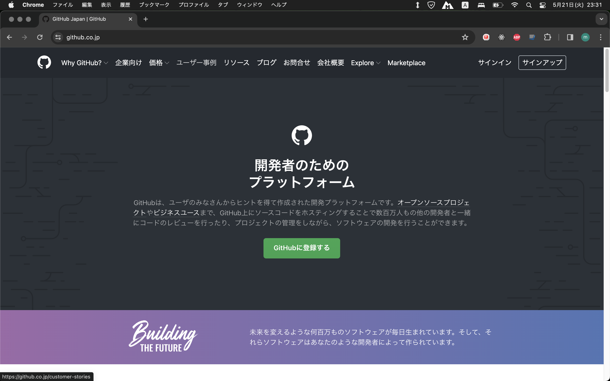

# git と GitHub についての新人研修

---

## 1. 目次

2. はじめに
3. ハンズオン1
---

## 2. はじめに

- git とは
  - バージョン管理システムの 1 つ
  - 分散型のアーキテクチャを採用
- GitHub とは
  - git のリポジトリをウェブ上で管理・共有するサービス
  - コードの公開・共有、Issue 管理、プルリクエストなどの機能がある
  - オープンソースプロジェクトの開発に広く利用されている。

---

## git とは

### バージョン管理システムの 1 つ

ソフトウェア開発において、ファイルの変更履歴を管理し、複数人での共同作業を可能にするツールです。

### 分散型のアーキテクチャを採用

これまでは SVN という集中型のバージョン管理システムを利用していたが、新しい管理システムが必要とされた。
このアーキテクチャでは、ネットワークに依存が少なくオフラインでの作業か可能となり、また速度向上もあり大規模開発に適したものになっている。

----

## Github

### コードの公開・共有、Issue 管理、プルリクエストなどの機能がある

---

## ハンズオン1 GitHub アカウントの作成

----

###### Github サイトへアクセス

[github](https://github.co.jp "github")にアクセスし、サインインをクリック
  
----

###### Account 情報入力

アカウントに必要な情報を入力
  

----

###### ログイン

認証

  

----

これでサインイン成功です

  

---

## ここまでの用語

- リポジトリ
- プルリクエスト

---

# Title

- Point 1l
- Point 223
- addx
- add

---

---

## Second slide

> Best quote ever.
> Best quote ever.

Note: speaker notes FTW!
